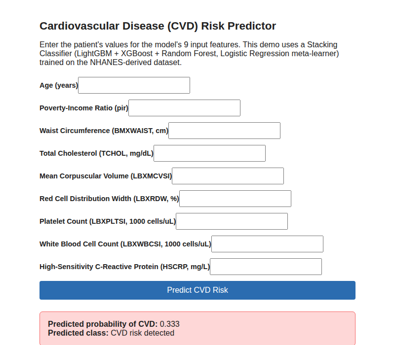
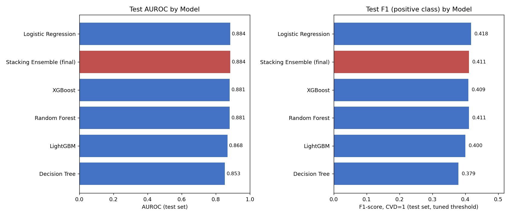

# CVD Risk Prediction (NHANES)

Predicting cardiovascular disease (CVD) risk from routine demographic, body-measurement and blood-test data, using a stacking ensemble (LightGBM + XGBoost + Random Forest) trained on the NHANES 2021-2023 survey. Includes the full pipeline from raw survey files to a small Flask web app that serves predictions.



## Highlights

| | |
|---|---|
| **Dataset** | NHANES 2021-2023, 10 modules merged on `SEQN`, 11,744 participants |
| **Target** | Self-reported heart failure, coronary heart disease, heart attack or stroke (about 8% positive) |
| **Features** | 9, selected from 17 by Random Forest importance plus correlation pruning |
| **Model** | `StackingClassifier`: LightGBM, XGBoost, Random Forest, with a Logistic Regression meta-learner |
| **Test AUROC / AUPRC** | 0.884 / 0.393 (prevalence baseline for AUPRC is 0.08) |
| **Test recall / precision (CVD class)** | 62.6% / 30.6% at a tuned threshold of 0.203 |
| **Serving** | Flask app with an HTML form and a JSON endpoint |

## Results

All six models were trained on the same stratified split (`random_state=42`), and each had its own decision threshold tuned on the validation set to maximise F1. Numbers below are on the held-out test set (2,349 participants, 187 with CVD).

| Rank | Model | AUROC | AUPRC | Precision | Recall | F1 | Threshold |
|---|---|---|---|---|---|---|---|
| 1 | Logistic Regression | 0.884 | 0.363 | 0.342 | 0.535 | 0.418 | 0.768 |
| 2 | **Stacking Ensemble (final)** | **0.884** | **0.393** | 0.306 | 0.626 | 0.411 | 0.203 |
| 3 | XGBoost | 0.881 | 0.378 | 0.307 | 0.615 | 0.409 | 0.640 |
| 4 | Random Forest | 0.881 | 0.312 | 0.290 | 0.706 | 0.411 | 0.244 |
| 5 | LightGBM | 0.868 | 0.333 | 0.293 | 0.631 | 0.400 | 0.380 |
| 6 | Decision Tree | 0.853 | 0.309 | 0.255 | 0.738 | 0.379 | 0.722 |



**Why the stack and not Logistic Regression?** They tie on AUROC, and Logistic Regression is slightly ahead on F1 and precision. The stack was kept because it has the best AUPRC, which is the more informative metric for an 8% positive class, and higher recall (117 vs 100 of the 187 true CVD cases caught) at similar precision. For a screening tool, where a missed case costs more than a false alarm, that trade-off was preferred. Logistic Regression remains a perfectly defensible, more interpretable alternative.

Final model confusion matrix on the test set:

| | Predicted no CVD | Predicted CVD |
|---|---|---|
| **Actual no CVD** | 1,897 | 265 |
| **Actual CVD** | 70 | 117 |

Confusion matrices for every model are in [`results/model_comparison_confusion.txt`](results/model_comparison_confusion.txt). A longer write-up of the method and the reasoning behind each choice is in [`docs/methodology.md`](docs/methodology.md).

## Pipeline

```
NHANES raw CSVs (10 modules)
        │  eda_cvd.py
        ▼
merge on SEQN → build CVD label → EDA plots → median imputation
        → RF feature importance → top 10 → drop |r| ≥ 0.85 pairs
        │
        ▼
data/cleaned_selected.csv  (9 features + label)
        │  cvd.py                          │  model_comparison.py
        ▼                                  ▼
train/val/test split (64/16/20)      same split, 6 models,
stacking ensemble                    per-model F1 threshold
F1-tuned threshold on val            → results/, figures/
        │
        ▼
models/cvd_model.joblib  {model, features, threshold}
        │  app.py
        ▼
Flask: HTML form + JSON API
```

## Features used

| Column | Meaning | Unit |
|---|---|---|
| `age` | Age at screening | years |
| `pir` | Family income to poverty ratio (0 to 5) | ratio |
| `BMXWAIST` | Waist circumference | cm |
| `TCHOL` | Total cholesterol | mg/dL |
| `LBXMCVSI` | Mean corpuscular volume | fL |
| `LBXRDW` | Red cell distribution width | % |
| `LBXPLTSI` | Platelet count | 1000 cells/µL |
| `LBXWBCSI` | White blood cell count | 1000 cells/µL |
| `HSCRP` | High-sensitivity C-reactive protein | mg/L |

`data/cleaned_dataset.csv` keeps all 17 candidate features (adds sex, race, BMI, glucose, HDL, insulin, haemoglobin and haematocrit) for anyone who wants to try a different feature set.

## Repository layout

```
CVD-Disease-Prediction/
├── eda_cvd.py               # Raw NHANES → cleaned data, EDA plots, feature selection
├── cvd.py                   # Trains the stacking model, tunes threshold, saves model
├── model_comparison.py      # Benchmarks 6 models on the same split
├── app.py                   # Flask app (form + JSON API)
├── templates/index.html     # Web form
├── data/
│   ├── cleaned_dataset.csv  # 11,744 rows, all 17 candidate features
│   └── cleaned_selected.csv # 11,744 rows, the 9 selected features (model input)
├── models/cvd_model.joblib  # Trained model + feature list + threshold
├── results/                 # Comparison table and confusion matrices
├── figures/                 # EDA, feature importance, threshold and comparison plots
├── docs/methodology.md      # Detailed method and design decisions
└── requirements.txt
```

## Getting started

Python 3.11 or newer.

```bash
git clone https://github.com/CLCelestial/CVD-Disease-Prediction.git
cd CVD-Disease-Prediction
python -m venv .venv
source .venv/bin/activate        # Windows: .venv\Scripts\activate
pip install -r requirements.txt
```

### Run the web app

The trained model is already in `models/`, so you can go straight to:

```bash
python app.py
```

Then open http://127.0.0.1:5000 and fill in the form.

The same model is available as a JSON API:

```bash
curl -X POST http://127.0.0.1:5000/predict \
  -H "Content-Type: application/json" \
  -d '{"age": 68, "pir": 1.2, "BMXWAIST": 110, "TCHOL": 170, "LBXMCVSI": 90,
       "LBXRDW": 14.5, "LBXPLTSI": 240, "LBXWBCSI": 8.1, "HSCRP": 4.2}'
```

```json
{"label": 0, "probability": 0.189}
```

`label` is 1 when `probability` is at or above the tuned threshold (0.203).

### Retrain the model

```bash
python cvd.py               # retrains, prints train/val/test metrics, overwrites models/cvd_model.joblib
python model_comparison.py  # regenerates results/ and figures/model_comparison.png
```

Both scripts use fixed seeds, and with the pinned versions in `requirements.txt` they reproduce the numbers above exactly. (XGBoost 3.3 and later changed something internally that shifts the XGBoost and stack results slightly, which is why it is pinned below 3.3.)

### Rebuild the dataset from raw NHANES files (optional)

The cleaned CSVs are committed, so this step is only needed to change the cleaning or feature selection. Download these files for the 2021-2023 cycle from the [NHANES website](https://wwwn.cdc.gov/nchs/nhanes/continuousnhanes/default.aspx?Cycle=2021-2023), convert them from `.xpt` to `.csv`, and put them in one folder:

`DEMO_L`, `BMX_L`, `BPXO_L`, `CBC_L`, `GLU_L`, `HDL_L`, `HSCRP_L`, `INS_L`, `MCQ_L`, `TCHOL_L`

```bash
python eda_cvd.py path/to/nhanes_csv_folder   # defaults to data/raw/
```

This rewrites `data/cleaned_dataset.csv`, `data/cleaned_selected.csv` and the EDA figures.

## Limitations

- **Self-reported label.** The target comes from the NHANES medical-conditions questionnaire, not clinical records, so some cases will be misclassified.
- **Cross-sectional data.** The model learns who already has CVD, not who will develop it. It is a risk-flagging exercise, not a validated prognostic score.
- **Medication confounding.** Mean total cholesterol is lower in the CVD group (169.8 vs 181.0 mg/dL), most likely because diagnosed patients are on statins. The features used cannot account for this.
- **Low precision.** About 7 in 10 positive flags are false alarms. That is the expected cost of favouring recall on an 8% positive class, and is acceptable only if a positive flag leads to a cheap follow-up check.
- **Demo server.** `app.py` uses Flask's development server and has no input validation or authentication.

**This is a student project and is not a medical device. Do not use it for real clinical decisions.**

## Data source

Centers for Disease Control and Prevention (CDC), National Center for Health Statistics (NCHS). National Health and Nutrition Examination Survey, 2021-2023. NHANES data is in the public domain.
