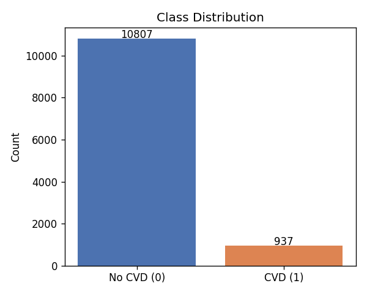
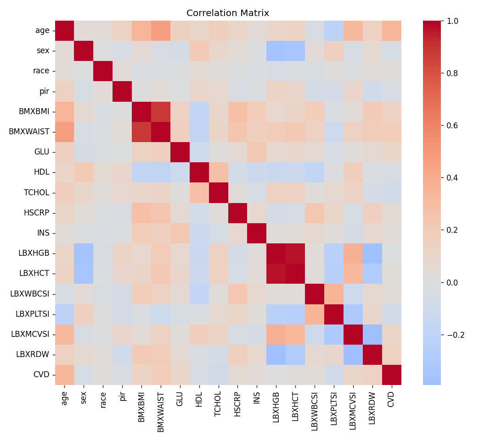
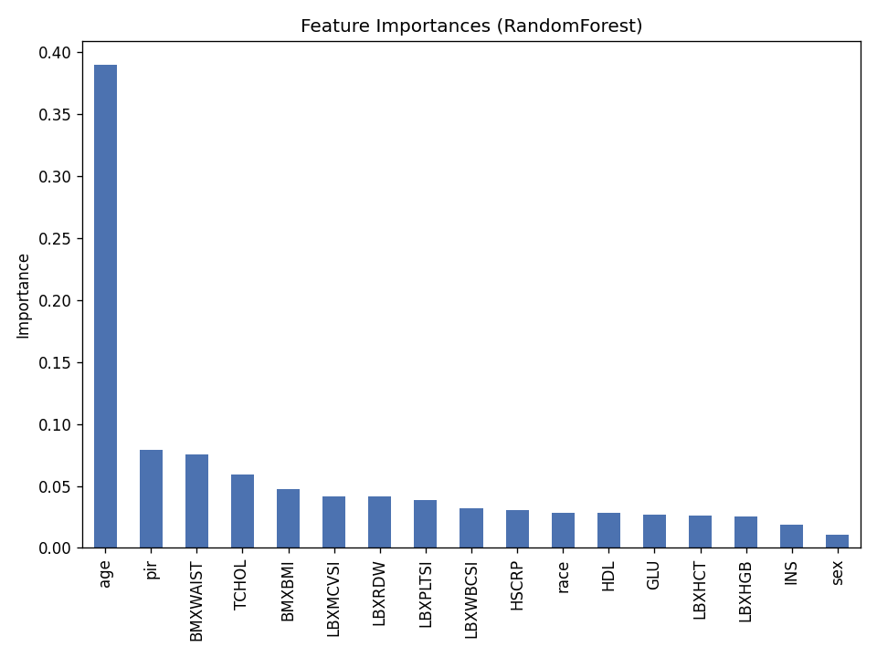
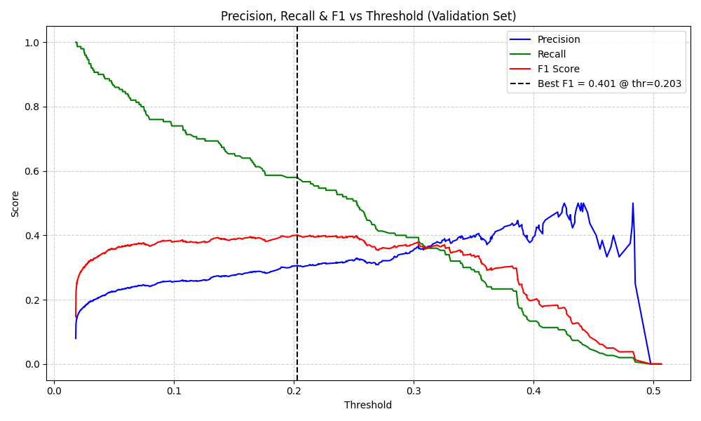

# Methodology

This document explains how the CVD risk model was built and why each design decision was made. For setup and usage, see the main [README](../README.md).

## 1. Data

### Source

The data comes from the 2021-2023 cycle of the National Health and Nutrition Examination Survey (NHANES), run by the US CDC. NHANES combines interviews with physical examinations and lab tests on a nationally representative sample. Ten modules were used:

| File | Module | Fields taken |
|---|---|---|
| `DEMO_L` | Demographics | age, sex, race/ethnicity, poverty-income ratio |
| `BMX_L` | Body measures | BMI, waist circumference |
| `BPXO_L` | Blood pressure (oscillometric) | systolic and diastolic readings |
| `CBC_L` | Complete blood count | haemoglobin, haematocrit, WBC, platelets, MCV, RDW |
| `GLU_L` | Fasting glucose | glucose |
| `HDL_L` | HDL cholesterol | HDL |
| `HSCRP_L` | High-sensitivity CRP | hs-CRP |
| `INS_L` | Insulin | insulin |
| `MCQ_L` | Medical conditions questionnaire | used for the label |
| `TCHOL_L` | Total cholesterol | total cholesterol |

All modules are joined on `SEQN`, the NHANES participant ID, which is the only key shared across every module. Demographics is the base table and everything else is left-joined onto it.

### Target

`CVD = 1` if the participant answered "yes" to any of these questionnaire items, otherwise 0:

| Item | Condition |
|---|---|
| `MCQ160B` | Congestive heart failure |
| `MCQ160C` | Coronary heart disease |
| `MCQ160E` | Heart attack |
| `MCQ160F` | Stroke |

Because NHANES is a survey, this self-report is the only diagnostic signal available for these conditions. It carries some misclassification risk, which is listed as a limitation.

### Class balance

| Class | Count | Share |
|---|---|---|
| No CVD (0) | 10,807 | 92.0% |
| CVD (1) | 937 | 8.0% |



At an 11.5 : 1 ratio, a model that always predicts "no CVD" scores 92% accuracy, so accuracy is not used to select models. AUROC, AUPRC, precision, recall and F1 on the positive class are reported instead.

## 2. Cleaning

Implemented in `eda_cvd.py`.

1. **Drop fully empty columns.** Any column that is 100% missing after the merge is removed. In practice this removed the two blood pressure features (see the note below).
2. **Median imputation.** Remaining gaps in numeric columns are filled with the column median. The median is robust to the heavy right skew common in lab values (hs-CRP, insulin). Dropping incomplete rows instead would have discarded a large share of participants and biased the sample toward people who completed every exam component.
3. **Deduplicate on `SEQN`.**

The result is `data/cleaned_dataset.csv`: 11,744 participants, 17 candidate features, no missing values.

> **Note on blood pressure.** The script looks for columns starting with `BPXSY` / `BPXDI`, but the 2021-2023 oscillometric file names them `BPXOSY1..3` / `BPXODI1..3`. No columns matched, so `SBP_mean` and `DBP_mean` came out entirely empty and were dropped at step 1. Blood pressure is a major CVD risk factor, so fixing the prefixes and re-running feature selection is the most obvious improvement to this project.



## 3. Feature selection

Also in `eda_cvd.py`.

1. A Random Forest (300 trees, `class_weight="balanced"`) was fit on an 80% split and used to rank all 17 features by Gini importance.
2. The top 10 were kept.
3. Among those 10, any pair with Pearson |r| ≥ 0.85 was pruned, keeping the more important feature. Only BMI and waist circumference crossed the line (r = 0.88), so BMI was dropped in favour of `BMXWAIST`.



Final 9 features: `age`, `pir`, `BMXWAIST`, `TCHOL`, `LBXMCVSI`, `LBXRDW`, `LBXPLTSI`, `LBXWBCSI`, `HSCRP`.

Age dominates (importance 0.39 vs 0.08 for the next feature), which matches the clinical literature. It also has by far the largest gap between the two classes:

| Feature | Mean, no CVD | Mean, CVD |
|---|---|---|
| age (years) | 36.4 | 67.9 |
| pir | 2.7 | 2.5 |
| BMXWAIST (cm) | 91.3 | 103.5 |
| TCHOL (mg/dL) | 181.0 | 169.8 |
| LBXMCVSI (fL) | 87.4 | 89.3 |
| LBXRDW (%) | 13.7 | 14.2 |
| LBXPLTSI (1000/µL) | 265.4 | 245.2 |
| LBXWBCSI (1000/µL) | 6.9 | 7.1 |
| HSCRP (mg/L) | 2.6 | 3.8 |

**Cholesterol runs the "wrong" way.** Total cholesterol is lower in the CVD group, the opposite of the textbook relationship. The likeliest explanation is reverse causation: people already diagnosed with CVD are commonly prescribed statins, which lower measured cholesterol. The fields used here do not record medication, so the model cannot separate the two effects.

## 4. Train / validation / test split

```
11,744 participants
├── test        20%   2,349   (touched once, for final reporting)
└── train+val   80%   9,395
    ├── train   64%   7,516   (model fitting)
    └── val     16%   1,879   (threshold tuning)
```

Both splits are stratified on `CVD` with `random_state=42`, and `model_comparison.py` uses the exact same split as `cvd.py`, so every model is evaluated on the same 2,349 people.

## 5. Model

Implemented in `cvd.py`.

### Stacking ensemble

A `StackingClassifier` trains several base models, then fits a meta-learner on their out-of-fold predicted probabilities to learn how best to combine them.

| Role | Model | Key settings | Imbalance handling |
|---|---|---|---|
| Base | LightGBM | 400 trees, lr 0.05, subsample 0.8, colsample 0.8 | `class_weight="balanced"` |
| Base | XGBoost | 400 trees, lr 0.05, max_depth 4, subsample 0.8, colsample 0.8, `hist` | `scale_pos_weight` ≈ 11.53 |
| Base | Random Forest | 300 trees, min_samples_leaf 2 | `class_weight="balanced"` |
| Meta | Logistic Regression | max_iter 200, on `predict_proba` outputs | n/a |

**Why these base learners.** LightGBM and XGBoost are both gradient-boosting methods and are strong defaults for tabular data. Random Forest is a bagging method with a different error profile, so mixing boosting and bagging gives the meta-learner more complementary signals than three boosting variants would.

**Why Logistic Regression as the meta-learner.** It only sees three inputs (one probability per base model), so a simple linear blend is enough and is far less likely to overfit than a complex meta-learner stacked on already-fitted models.

**Why class weighting instead of SMOTE or undersampling.** Weighting the loss makes errors on the minority class cost more without inventing synthetic patients or throwing real ones away. It was not formally benchmarked against SMOTE, which is left as future work.

### Threshold tuning

With 8% prevalence, most true CVD cases get predicted probabilities below 0.5 even when the model ranks them correctly, so the default 0.5 cutoff badly under-predicts the positive class.

The threshold is chosen on the **validation** set by sweeping the precision-recall curve and taking the point that maximises F1. For the final model this gives **0.203**: anyone with a predicted probability of about 20% or more is flagged. This leans toward recall on purpose, because for a screening tool a missed case is worse than a false alarm.



`choose_threshold()` also has a `mode="specificity"` option that targets a fixed specificity (default 90%) instead. That gives a higher threshold, fewer false alarms and fewer true cases caught.

Each model in the comparison gets its own tuned threshold (0.203 to 0.768), because different model types produce differently calibrated probabilities. Tree ensembles tend to squash probabilities toward the middle of the range, so reusing one threshold across models would be unfair to some of them.

## 6. Evaluation

### Final model, all splits

| Split | AUROC | AUPRC | Precision (CVD) | Recall (CVD) | F1 (CVD) |
|---|---|---|---|---|---|
| Train | 0.973 | 0.762 | 0.454 | 0.935 | 0.611 |
| Validation | 0.874 | 0.323 | 0.306 | 0.580 | 0.401 |
| Test | 0.884 | 0.393 | 0.306 | 0.626 | 0.411 |

The train scores are clearly higher, which is normal for a three-model ensemble on about 7,500 rows. What matters is that validation and test agree closely, which shows the model generalises rather than memorising.

An AUPRC of 0.393 can look low in isolation, but the baseline for a random classifier is the prevalence, 0.08, so the model gives roughly a 5x lift.

### Test confusion matrix (threshold 0.203)

| | Predicted no CVD | Predicted CVD |
|---|---|---|
| **Actual no CVD** | 1,897 (TN) | 265 (FP) |
| **Actual CVD** | 70 (FN) | 117 (TP) |

117 of 187 true cases are caught (recall 62.6%). Of the 382 people flagged, 117 actually have CVD (precision 30.6%). That precision is the expected cost of a low threshold on a rare class, and it is acceptable only if a positive flag leads to a cheap follow-up test rather than treatment.

### Model comparison

`model_comparison.py` trains five standalone models plus the stack on the same split with the same threshold procedure:

| Rank | Model | AUROC | AUPRC | Precision | Recall | F1 | Accuracy |
|---|---|---|---|---|---|---|---|
| 1 | Logistic Regression (scaled, balanced) | 0.884 | 0.363 | 0.342 | 0.535 | 0.418 | 0.881 |
| 2 | Stacking Ensemble (final) | 0.884 | 0.393 | 0.306 | 0.626 | 0.411 | 0.857 |
| 3 | XGBoost | 0.881 | 0.378 | 0.307 | 0.615 | 0.409 | 0.859 |
| 4 | Random Forest | 0.881 | 0.312 | 0.290 | 0.706 | 0.411 | 0.839 |
| 5 | LightGBM | 0.868 | 0.333 | 0.293 | 0.631 | 0.400 | 0.849 |
| 6 | Decision Tree (depth 6) | 0.853 | 0.309 | 0.255 | 0.738 | 0.379 | 0.808 |

Takeaways:

- **Logistic Regression is as good as the stack on AUROC** and a little better on precision and F1. The stack was still chosen for its higher AUPRC (0.393 vs 0.363) and higher recall (17 more true cases caught out of 187). That is a deliberate recall-over-precision trade-off, not a case of the stack winning outright. Choosing Logistic Regression for its simplicity and interpretability would also be reasonable.
- **Random Forest alone has higher recall (70.6%)** but worse precision and AUPRC, so it buys those extra catches with noticeably more false alarms.
- **The Decision Tree is a baseline.** Capped at depth 6 to avoid overfitting a small positive class, it cannot match the ensembles or the regularised linear model.

## 7. Deployment

`app.py` loads `models/cvd_model.joblib` once at startup. The file holds a dict with three keys: `model` (the fitted stack), `features` (column order) and `threshold`.

| Route | Method | Input | Output |
|---|---|---|---|
| `/` | GET | none | HTML form |
| `/predict_form` | POST | form fields for the 9 features | form page with probability and label |
| `/predict` | POST | JSON object with the 9 features | `{"probability": float, "label": 0 or 1}` |

Input is turned into a one-row DataFrame in the exact feature order the model was trained on, passed to `predict_proba`, and compared to the stored threshold.

**Not production ready:** it uses Flask's development server, does no input validation or range checks, has no authentication, and has no logging or drift monitoring. A real deployment would put it behind a WSGI server such as gunicorn and add all of the above.

## 8. Future work

- Fix the blood pressure column prefixes (`BPXOSY*`, `BPXODI*`) and re-run feature selection.
- Compare class weighting with SMOTE and other resampling methods.
- Tune hyperparameters with cross-validation instead of using fixed values.
- Calibrate probabilities (Platt or isotonic) so the output can be read as a real risk percentage.
- Add SHAP explanations to show which features drove each prediction.
- Add medication fields (for example statin use) to address the cholesterol confounding.
- Validate on a different NHANES cycle to check that the model holds up over time.
